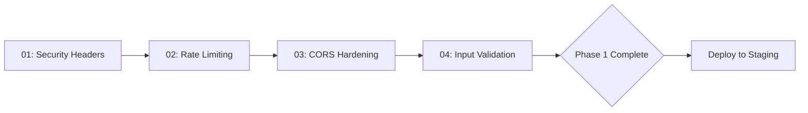
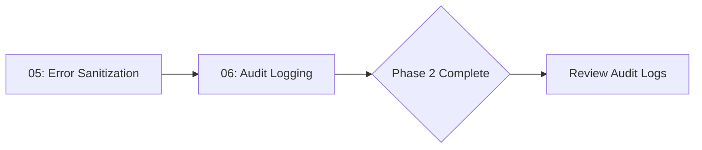
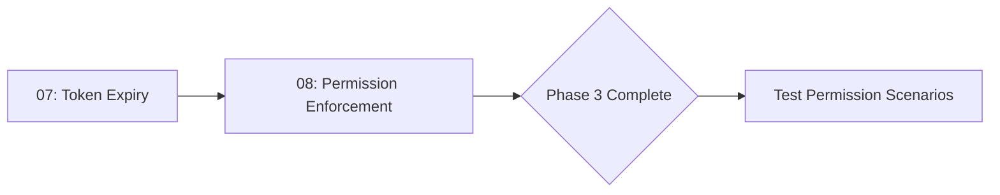
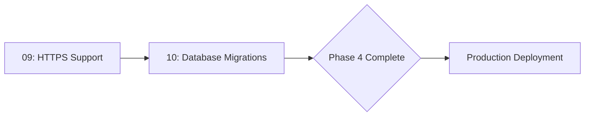

# ClawChives Security Hardening Implementation Skill

[](#)
[](#)

> **Purpose:** Transform ClawChives from development-ready to production-hardened with defense-in-depth security.

---

## 📋 Table of Contents

1. [Overview](#overview)
2. [Security Vulnerabilities Addressed](#security-vulnerabilities-addressed)
3. [Implementation Components](#implementation-components)
4. [Integration Roadmap](#integration-roadmap)
5. [Testing Strategy](#testing-strategy)
6. [Deployment Considerations](#deployment-considerations)

---

## Overview

This skill provides a **complete security hardening implementation** for ClawChives following OWASP best practices and industry standards. Each component is designed to be:

- ✅ **Modular** - Implement one component at a time
- ✅ **Auditable** - Clear documentation of why, what, and how
- ✅ **Backward compatible** - Migrations handle existing data
- ✅ **Self-hosted friendly** - Works on LAN, supports reverse proxy for public hosting
- ✅ **Future-proof** - Compatible with planned PWA implementation

### Architecture Principles

1. **Defense in Depth** - Multiple security layers (headers + validation + rate limiting + audit)
2. **Fail Secure** - Deny-by-default (CORS, permissions)
3. **Least Privilege** - Granular permissions enforced server-side
4. **Audit Trail** - Log all security-relevant events
5. **Token Lifecycle** - Configurable expiration (30/60/90/custom days)

---

## Security Vulnerabilities Addressed

### Critical (CVSS 9.0+)
- ❌ **Plaintext key storage** → ✅ Document encryption-at-rest strategy
- ❌ **No rate limiting** → ✅ Brute-force protection on auth endpoints
- ❌ **No security headers** → ✅ Helmet.js with CSP, HSTS, X-Frame-Options

### High (CVSS 7.0-8.9)
- ❌ **CORS allow-all default** → ✅ Deny-by-default, require CORS_ORIGIN
- ❌ **Error message leakage** → ✅ Sanitized errors in production
- ❌ **No input validation** → ✅ Zod schemas for all endpoints
- ❌ **Permissions not enforced** → ✅ Server-side permission checks

### Medium (CVSS 4.0-6.9)
- ❌ **No audit logging** → ✅ Comprehensive security event logs
- ❌ **No token expiration** → ✅ Configurable 30/60/90/custom day TTL
- ❌ **Username enumeration** → ✅ Generic error messages

---

## Implementation Components

Each component is in its own directory with:
- **README.md** - Why, what, how, security rationale
- **Code snippets** - TypeScript/JavaScript with inline docs
- **Integration notes** - How it connects to existing codebase

### Component Overview

| # | Component | Priority | Complexity | Dependencies |
|---|-----------|----------|------------|--------------|
| 01 | [Security Headers](01-security-headers/) | Critical | Low | helmet |
| 02 | [Rate Limiting](02-rate-limiting/) | Critical | Medium | express-rate-limit |
| 03 | [CORS Hardening](03-cors-hardening/) | Critical | Low | cors (existing) |
| 04 | [Input Validation](04-input-validation/) | Critical | Medium | zod |
| 05 | [Error Sanitization](05-error-sanitization/) | High | Low | none |
| 06 | [Audit Logging](06-audit-logging/) | High | Medium | better-sqlite3 (existing) |
| 07 | [Token Expiry](07-token-expiry/) | Medium | Medium | none |
| 08 | [Permission Enforcement](08-permissions/) | Medium | High | none |
| 09 | [HTTPS Support](09-https-support/) | Low | Low | none |
| 10 | [Database Migrations](10-migrations/) | Low | Low | better-sqlite3 (existing) |

---

## Integration Roadmap

### Phase 1: Critical Foundation (Week 1)
**Goal:** Block common web vulnerabilities, prevent brute-force



**Deliverables:**
- Helmet.js configured with CSP
- Auth endpoint rate limiting (5/15min)
- CORS deny-by-default enforcement
- Zod validation on all inputs

**Testing:** Manual attack simulations (brute-force, CORS bypass attempts, XSS payloads)

### Phase 2: Observability & Error Handling (Week 2)
**Goal:** Create audit trail, prevent info disclosure



**Deliverables:**
- Generic error messages in production
- Audit log table + middleware
- Log auth attempts, key operations

**Testing:** Verify error messages don't leak schema, check audit log completeness

### Phase 3: Access Control & Token Lifecycle (Week 3)
**Goal:** Enforce permissions, limit token lifetime



**Deliverables:**
- 30/60/90/custom day token TTL
- UI dropdown for expiry selection
- Server-side permission checks on all routes

**Testing:** Create agent keys with limited permissions, verify enforcement

### Phase 4: Transport & Deployment (Week 4)
**Goal:** Support HTTPS, provide migration path



**Deliverables:**
- HTTPS redirect middleware (optional)
- Nginx reverse proxy example config
- Database migration script for existing data

**Testing:** Test LAN deployment, reverse proxy setup, migration on test database

---

## Testing Strategy

### Unit Tests
Create `tests/security/` with:
- `rate-limiting.test.js` - Verify limiters enforce thresholds
- `validation.test.js` - Test Zod schemas reject malformed input
- `permissions.test.js` - Test permission enforcement logic
- `token-expiry.test.js` - Test expiration calculation
- `error-sanitization.test.js` - Verify no info leakage

### Integration Tests
- `auth-flow.test.js` - Registration → token issuance → API call
- `agent-keys.test.js` - Create, use, revoke, expire agent keys
- `cors.test.js` - Verify CORS blocks unauthorized origins
- `audit-logs.test.js` - Verify events are logged

### Security Tests
- SQL injection attempts on all endpoints
- XSS payloads in bookmarks/folders
- Brute-force auth attempts
- Permission escalation attempts
- CORS bypass attempts

### Manual Verification Checklist
- [ ] Register user → audit log entry exists
- [ ] 6 failed logins → rate limit kicks in at 5
- [ ] Agent key read-only → write returns 403
- [ ] Token expires → auth returns 401 "Token expired"
- [ ] Malformed URL → validation error 400
- [ ] Unauthorized CORS origin → rejected
- [ ] Response headers include CSP, HSTS
- [ ] Production errors don't include SQL details

---

## Deployment Considerations

### LAN Deployment (Default)
```yaml
# docker-compose.yml
environment:
  - NODE_ENV=production
  - CORS_ORIGIN=http://192.168.1.100:5173
  - TOKEN_TTL_DEFAULT=30
  - ENFORCE_HTTPS=false  # No HTTPS on LAN
```

**Behavior:**
- Works without internet
- Tokens expire per configuration
- No HTTPS enforcement (optional for LAN)

### Public Self-Hosted (Reverse Proxy)
```yaml
# docker-compose.yml
environment:
  - NODE_ENV=production
  - CORS_ORIGIN=https://your-domain.com
  - TOKEN_TTL_DEFAULT=30
  - ENFORCE_HTTPS=true
  - TRUST_PROXY=true  # For correct IP logging behind Nginx
```

**Additional setup:**
- Nginx/Caddy reverse proxy with SSL termination
- Let's Encrypt for free SSL certificates
- See [09-https-support/nginx-example.conf](09-https-support/nginx-example.conf)

### Future PWA Support
- Service workers require HTTPS in production
- Works on `localhost` without HTTPS (dev/testing)
- Token expiry compatible with offline-first architecture
- Audit logs can sync when connection restored

---

## Environment Variables

### Required for Production
```bash
CORS_ORIGIN=https://your-domain.com  # Comma-separated for multiple origins
```

### Optional Configuration
```bash
# Token expiration
TOKEN_TTL_DEFAULT=30              # Days (default 30)
TOKEN_TTL_OPTIONS=30,60,90,custom # Available dropdown options
TOKEN_TTL_CUSTOM=2592000000       # Milliseconds (30 days) for custom option

# HTTPS (for reverse proxy deployments)
ENFORCE_HTTPS=true                # Redirect HTTP → HTTPS
TRUST_PROXY=true                  # Trust X-Forwarded-* headers

# Rate limiting (optional tuning)
AUTH_RATE_LIMIT=5                 # Attempts per window
AUTH_RATE_WINDOW=900000           # Window in ms (15 min)

# Validation (optional gradual rollout)
STRICT_VALIDATION=true            # Enforce strict Zod validation

# Migration (one-time)
MIGRATE_EXISTING_TOKENS=true      # Set 30-day expiry on old tokens
```

---

## Dependencies to Add

```json
{
  "dependencies": {
    "helmet": "^8.0.0",
    "express-rate-limit": "^7.0.0",
    "zod": "^3.23.0"
  }
}
```

**Install command:**
```bash
npm install helmet express-rate-limit zod
```

---

## Implementation Order

### Recommended Path
1. Read all component READMEs to understand architecture
2. Review code snippets for integration points
3. Implement components 01-04 (Critical) together
4. Test thoroughly before proceeding
5. Implement components 05-06 (High) together
6. Review audit logs for issues
7. Implement components 07-08 (Medium) together
8. Test permission scenarios extensively
9. Implement components 09-10 (Low) as needed
10. Production deployment

### Alternative: One-by-One
- Implement and test each component individually
- Safer but slower (10 separate deployments)
- Good for learning the codebase

---

## Success Criteria

### Phase 1 Complete
- ✅ Helmet headers visible in browser dev tools
- ✅ Auth rate limiting blocks after 5 attempts
- ✅ Unauthorized CORS origin rejected
- ✅ Malformed input returns 400 validation errors

### Phase 2 Complete
- ✅ Production errors are generic (no SQL details)
- ✅ Audit log table populated with auth events
- ✅ Audit log queryable via admin endpoint (future)

### Phase 3 Complete
- ✅ Token expiry UI shows 30/60/90/custom dropdown
- ✅ Expired tokens return 401 with clear message
- ✅ Agent keys with read-only cannot write (403)

### Phase 4 Complete
- ✅ Nginx reverse proxy config works
- ✅ HTTPS redirect active when ENFORCE_HTTPS=true
- ✅ Migration script runs without errors on test DB

### Production Ready
- ✅ All phases complete
- ✅ Security tests pass
- ✅ Manual verification checklist complete
- ✅ CORS_ORIGIN configured
- ✅ Reverse proxy (if public) configured with SSL
- ✅ Backup strategy in place for sqlite_data volume

---

## Support & Resources

### Documentation
- [OWASP Top 10](https://owasp.org/www-project-top-ten/)
- [Helmet.js Docs](https://helmetjs.github.io/)
- [Express Rate Limit](https://express-rate-limit.mintlify.app/)
- [Zod Documentation](https://zod.dev/)

### Code References
- [server.js](../server.js) - Main API server
- [agentPermissions.ts](../src/services/agents/agentPermissions.ts) - Existing permission logic
- [SECURITY.md](../SECURITY.md) - Current security policy

### Getting Help
- Review component READMEs for troubleshooting
- Check audit logs for security events
- Test in isolated environment before production
- Open GitHub issue for bugs/questions

---

## License & Attribution

This security hardening implementation is part of ClawChives.

**Contributors:**
- Lucas (Product Owner)
- Claude Sonnet 4.5 (Security Audit & Implementation Design)

**Acknowledgments:**
- OWASP Foundation for security best practices
- Express.js security middleware maintainers

---

## Next Steps

1. **Audit this skill file** - Review all components, provide feedback
2. **Iterate on design** - Improve based on audit findings
3. **Begin implementation** - Start with Phase 1 (components 01-04)
4. **Test incrementally** - Verify each component before moving forward
5. **Deploy to production** - Once all phases complete and tested

**Ready to proceed?** Start with [01-security-headers](01-security-headers/README.md)!
