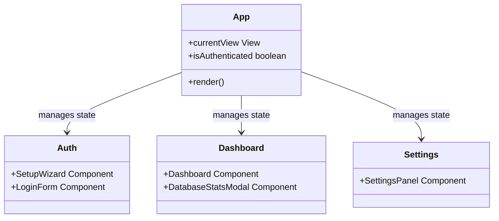

# 🏗️ System Blueprint: ClawChives

[](#)

This document serves as the high-level structural map of the ClawChives frontend project. It guarantees a separation of concerns driven by feature domains.

## Directory Tree

```text
ClawChives/
├── .gitignore
├── docker-compose.yml       # Dev container orchestration
├── Dockerfile               # Node environment definition
├── index.html               # Main entry HTML
├── package.json             # NPM dependencies & scripts
├── postcss.config.js        # CSS parsing config
├── tailwind.config.js       # UI Design token config
├── tsconfig.json            # TypeScript rules
├── tsconfig.node.json       # Node environment TS rules
├── vite.config.ts           # Bundler configuration
│
└── src/                     # Core Application Source
    ├── App.tsx              # Root Component / View Controller
    ├── index.css            # Global CSS / Tailwind Entry
    ├── main.tsx             # React Mount entry
    │
    ├── components/          # Feature-scoped components
    │   ├── auth/            # Authentication Views
    │   ├── dashboard/       # Main Data Views
    │   ├── landing/         # Marketing/Entry Views
    │   └── settings/        # App Configuration Views
    │
    ├── hooks/               # Custom React Hooks (Logic sharing)
    │
    ├── lib/                 # Third-party wrappers/Core Libs
    │   └── indexedDB/       # Client-side DB adapters
    │
    ├── services/            # API & external integration logic
    │
    └── types/               # TypeScript interface/type definitions
```

## Architectural Tenets

<details>
  <summary>View Core Principles</summary>

1. **Separation of Concerns**: Components display data. Hooks manage React state. Services handle data fetching/logic.
2. **Feature First**: All directories inside `components/` are nested by feature area (`auth`, `dashboard`), avoiding generic `buttons`, `inputs` monoliths unless established as a core UI library.
3. **No Monoliths**: Files must remain small, single-responsibility entities.
4. **Locality of Behavior**: Styles, State, and Markup should co-exist gracefully where practical, leveraging Tailwind to avoid CSS scattering.
</details>


