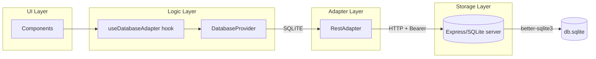
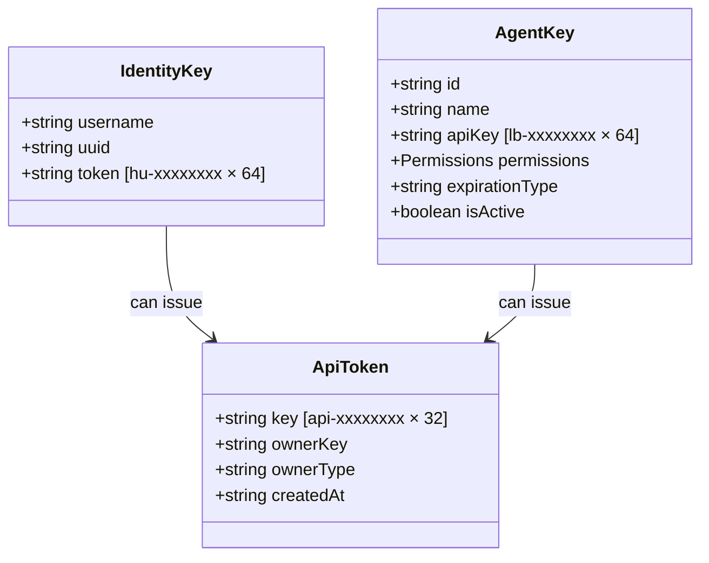
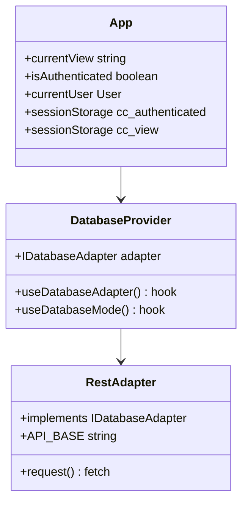

# 🏗️ System Blueprint: ClawChives

[](#)
[](#)

> ASCII Construction Blueprint — the authoritative structural reference for ClawChives.

---

## Full Directory Tree

```text
ClawChives/
│
├── 📄 index.html                    # Vite HTML entry point
├── 📄 package.json                  # NPM dependencies & scripts
├── 📄 vite.config.ts                # Vite bundler config
├── 📄 tsconfig.json                 # TypeScript strict rules
├── 📄 tsconfig.node.json            # Node-specific TS config
├── 📄 tailwind.config.js            # Design token system
├── 📄 postcss.config.js             # CSS processor pipeline
├── 📄 components.json               # shadcn/ui component registry
├── 📄 .env.example                  # Environment variable reference
│
├── 🐳 Dockerfile                    # Frontend container (Vite dev/build)
├── 🐳 Dockerfile.api                # API server container (Express + SQLite)
├── 🐳 docker-compose.yml            # Single-container stack (UI + API)
│                                      Volume mount: ./data → /app/data
│
├── 🌐 server.ts                    # TypeScript entrypoint (Express REST API)
│                                      Wiring: routes, middleware, audit initialization
│
├── src/
│   ├── server/                      # ◀ Backend Source (Refactored v2)
│   │   ├── db.ts                    # SQLite singleton, schema, & migrations
│   │   ├── middleware/              # auth, rateLimiter, validate, errorHandler
│   │   ├── routes/                  # auth, bookmarks, folders, agentKeys, settings
│   │   ├── utils/                   # auditLogger, crypto, parsers, tokenExpiry
│   │   └── validation/              # Zod schemas for all endpoints
│   │
    │
    ├── 📄 main.tsx                  # React mount point (wraps in DatabaseProvider)
    ├── 📄 App.tsx                   # Root view controller + session state manager
    │                                  sessionStorage: cc_authenticated, cc_view
    ├── 📄 index.css                 # Global styles + Tailwind CSS directives
    │
    ├── components/                  # Feature-scoped UI components
    │   ├── auth/
    │   │   ├── LoginForm.tsx        # Identity file upload + One-Field hu- token validation
    │   │   └── SetupWizard.tsx      # First-run: username, UUID, key generation
    │   │                             Exports clawchives_identity_key.json
    │   ├── dashboard/
    │   │   ├── Dashboard.tsx        # Main layout: header, sidebar, content
    │   │   ├── BookmarkGrid.tsx     # Responsive bookmark card grid
    │   │   ├── BookmarkModal.tsx    # Add/Edit bookmark form
    │   │   ├── Sidebar.tsx          # Folder tree + filter navigation
    │   │   └── DatabaseStatsModal.tsx # IndexedDB record counts + size
    │   ├── landing/
    │   │   └── LandingPage.tsx      # Unauthenticated entry page
    │   ├── settings/
    │   │   ├── SettingsPanel.tsx    # Settings tabbed layout
    │   │   ├── ProfileSettings.tsx  # Display name, avatar, email
    │   │   ├── AppearanceSettings.tsx # Theme, layout, items-per-page
    │   │   └── AgentKeyGeneratorModal.tsx # lb- key creation with permissions
    │   └── ui/                      # shadcn/ui base components
    │       ├── button.tsx
    │       ├── card.tsx
    │       ├── input.tsx
    │       ├── label.tsx
    │       └── select.tsx
    │
    ├── services/                    # Business logic + data access
    │   ├── index.ts                 # Barrel export
    │   ├── database/
    │   │   ├── adapter.ts           # ◀ IDatabaseAdapter interface (contract)
    │   │   ├── DatabaseProvider.tsx # ◀ React context: resolves RestAdapter
    │   │   └── rest/
    │   │       └── RestAdapter.ts   # fetch() → server.js (SQLite mode)
    │   ├── bookmarks/               # Bookmark CRUD operations
    │   ├── folders/                 # Folder management
    │   ├── agents/                  # Agent key operations
    │   ├── users/                   # User profile management
    │   ├── auth/                    # Auth helper functions
    │   ├── settings/                # Appearance + profile settings
    │   ├── types/                   # Shared TypeScript interfaces
    │   └── utils/                   # Constants, errors, DB helpers
    │
    ├── hooks/
    │   └── useAuth.ts               # Authentication state hook
    │
    ├── lib/
    │   ├── crypto.ts                # SHA-256 token hashing utilities
    │   ├── api.ts                   # API client helpers
    │   ├── exportImport.ts          # JSON bookmark import/export
    │   └── utils.ts                 # Shared utility functions
    │
    └── types/
        ├── index.ts                 # App-wide TypeScript types
        └── agent.ts                 # AgentKey type + ExpirationType enum
```

---

## Data Flow



---

## Architectural Tenets

<details>
<summary>View Core Principles</summary>

1. **Separation of Concerns** — Components display. Hooks manage state. Services handle data. Adapters abstract storage.
2. **Feature First** — All directories inside `components/` are nested by feature area (auth, dashboard, settings). No flat generic component soup.
3. **No Monoliths** — Files are single-responsibility. A growing file is a signal to refactor.
4. **Adapter Pattern** — The `IDatabaseAdapter` interface decouples the UI from storage.
5. **Auth is Always Client-Side** — Identity key validation always occurs in the browser memory (`sessionStorage`) and `SetupWizard`. The server never holds the raw identity tokens.
6. **One-Field Login** — Users can login using only their `hu-` key. The server performs a secure lookup via the `UNIQUE` `key_hash` index.
7. **Explicit State** — Navigation state and auth state are persisted in `sessionStorage` using namespaced keys (`cc_authenticated`, `cc_view`).
8. **Sovereign Reading** — `r.jina.ai` integration allows human-only conversion of Pinchmarks to LLM-friendly markdown.
9. **Visual UI Lock-in** — The current interface layout is final. All future primitives, modals, and views must adhere to the established spatial hierarchy. No element moves; we only expand within the Shell.

</details>

---

## Key System



---

## Component Class Diagram


