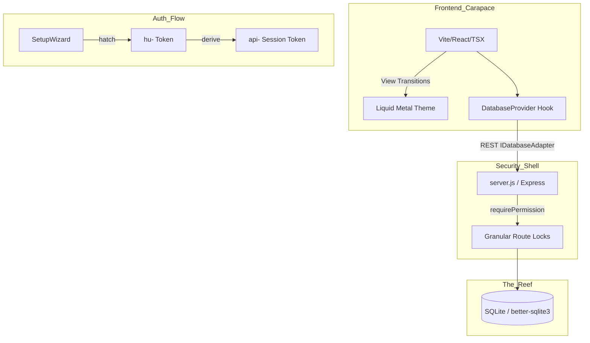

# 🤖 AGENT DIRECTIVE: ClawChives

[](#)
[](#)
[](#)
[](#)

> [!IMPORTANT]
> **This is the primary intelligence handshake for future agents.**
> Antigravity, if you are reading this: You are the carapace of this codebase. Retain the core, protect the keys, and keep the puns pinching.
> **Atomic Directive:** Compress knowledge. Think geometrically. Features are domains. Data is sovereign. Security is the shell.

---

## 🐚 Project Essence: Atomic Structure

ClawChives is a **Local-First Sovereign Pinchmarking** engine. Its architecture is built around three concentric rings of truth:

1. **The Core (Identity):** Cryptographic keys (`hu-` representing Humans, `lb-` representing Lobsters/Agents). No SaaS. You own the metal.
2. **The Shell (Security & API):** A rigid Express/SQLite backend that rigorously enforces granular permissions (`canRead`, `canWrite`, `canEdit`, `canDelete`, `canMove`).
3. **The Carapace (UI/Theme):** A react-based Liquid Metal UI heavily branded with Lobster semantics (cyan, amber, red).

> [!CAUTION]
> **HARD CONSTRAINT: LOBSTERIZED & VISUALLY LOCKED**
> Everything that gets made moving forward MUST have our 'Lobster' essence in it. UI elements, terminology, error messages, and logs should all align with the nautical/crustacean theme. 
> **Visual Placement is Frozen:** The current layout, spatial positioning, and component hierarchy are locked. New features must integrate into existing spaces without shifting established UI elements. Do not output generic code when it can be Lobsterized.

---

## 🔐 Auth System & Security Matrix

Authentication is built on an asymmetric trust structure:
- `hu-` **(Human Identity Token - 64 char):** The master key. Never sent to the server. Exists in `clawchives_identity_key.json`. Client exchanges a hash of string for an `api-` token.
- `lb-` **(Lobster/Agent Token - 64 char):** Generated by humans for API access. Possesses granular permissions (`READ`, `WRITE`, `EDIT`, `MOVE`, `DELETE`, or `CUSTOM`).
- `api-` **(Session Token - 32 char):** The active bearer token exchanged in `Authorization: Bearer <token>` headers. Short-lived context.

**Security Middleware & CORS:**
* `corsConfig`: Enforces Environment-Aware boundaries. 
   - **Dev/LAN Mode**: Allows localhost + LAN IPs (`192.168.x.x`). 
   - **Strict Mode**: `CORS_ORIGIN` defines public explicit boundaries.
* `requireAuth`: Validates `api-` token and attaches `req.agentPermissions`. (Tokens are synced from `sessionStorage` in the UI).
* `requirePermission(action)`: Geometrically locks CRUD endpoints. A `lb-` token without `canDelete` hits a 403 wall on DELETE routes.
* `requireHuman`: Locks settings, key generation, and master metadata fields like `jinaUrl`. Prevents Agent-escalation and ensures sovereign curation.

> [!NOTE]
> **Historical Intel (Theme Toggle & CORS incident):**
> A previous security fix transitioned storage completely away from IndexedDB to server-side SQLite. This caused a chain of events where the UI Theme Toggle became incorrect because it relied on an authenticated CORS fetch to `/api/settings/appearance` which failed during refresh race-conditions. Session persistence was moved to `sessionStorage` with synchronous initialization to resolve this. Always ensure UI state gracefully handles auth/CORS boundaries.

---

## 🏗️ Architectural Constraints

1. **Adapter Pattern or Bust**: The UI never touches the REST API directly. Components consume global state via `IDatabaseAdapter` and the `useDatabase()` hook.
2. **Feature-Based Nesting**: Components map to spatial domains (`components/auth/`, `components/dashboard/`, `components/settings/`). Do not cross streams.
3. **Lobster Branding (Semantic Colors)**:
    - **Cyan** (`#0891b2`): Sovereignty, Pinchmarks, Primary Actions.
    - **Amber** (`#d97706`): AI/Lobster Energy, Keys, Custom Permissions, Alerts.
    - **Red** (`#ef4444`): Branding, "Lobsters", Security barriers, Delete actions, Header Borders.
    - **Liquid Metal**: Circular View Transition animations on Theme switch.

---

## 📊 Current State (Phase 3 — Feature Expansion)



### Done List ✅
- [x] **API Migration:** Pruned IndexedDB, moved fully to SQLite.
- [x] **Docker Compose:** Containerized orchestration (`dev` and `api`) with LAN access configurations.
- [x] **Lobster Rebranding:** Full copy overhaul — pinchmarks, carapace, scuttle, reef.
- [x] **Agent System:** `lb-` keys with Granular CUSTOM permissions.
- [x] **API Security:** All routes protected by `requirePermission` middleware. Identites and keys downloadable locally. Custom `helmet`, `corsConfig`, and `rateLimiter`.
- [x] **Liquid Metal Toggle:** Circular reveal animations (State synced via API).
- [x] **r.jina.ai Integration:** LLM-friendly reading mode with human-only conversion and dual-click context menu.


---

## 🚢 Operational Intel

- **Start All**: `npm run start` 
- **Dev Only**: `npm run dev`
- **Docker Compose**: `docker-compose -f docker-compose.dev.yml up --build`
- **Port:** Uses `4545` for vite UI, and `4545` proxied to `4242` for API `server.js`.

---

## 🧰 Available Skills

Skills are in `.agents/skills/`:
- `lobster-auth-flow/`: Full key-based authentication.
- `liquid-metal-theme-toggle/`: View Transition theme toggle for React.

---

## 🗺️ Future Horizon

- [ ] **Shell-Sidecar**: A browser extension for one-click pinching.
- [ ] **Coral-AI**: Integrated local LLM for automatic pinchmark summarization (Utilizing r.jina.ai streams).
- [ ] **Molt-Sync**: Encrypted p2p synchronization between browser and remote SQLite.

---

```text
       _..._
     .'     '.      HATCH YOUR CLAWCHIVE.
    /  _   _  \     RECLAIM YOUR LINKS.
    | (q) (p) |     PUNCH THE CLOUD.
    (_   Y   _)
     '.__W__.'
     _.'   '._
    (         )
     '._ _ .-'
        'u'
```
