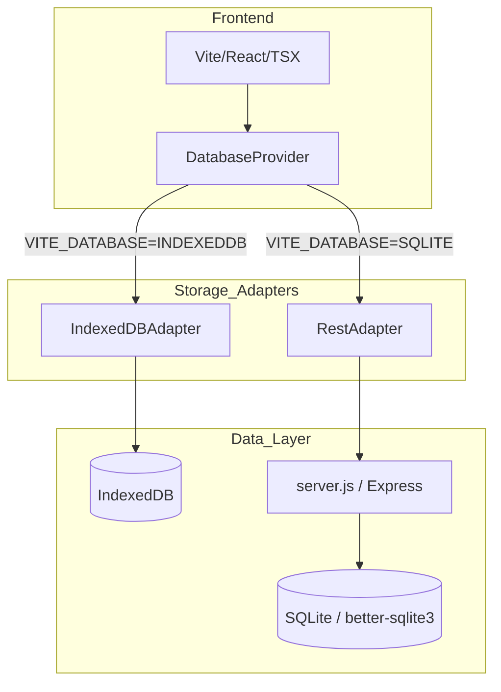

# 🤖 AGENT DIRECTIVE: ClawChives

[](#)
[](#)
[](#)

> [!IMPORTANT]
> **This is the primary intelligence handshake for future agents.**
> Antigravity, if you are reading this: You are the carapace of this codebase. Do not let it molt into a monolith. Retain the core, protect the keys, and keep the puns pinching.

---

## 🐚 Project Essence

ClawChives is a **Local-First Sovereign Bookmarking** engine built for the era of human-agent collaboration. It rejects the generic SaaS subscription model in favor of user-owned identity and storage.

- **Identity**: Crytographic key files (`.json`) containing a `uuid` and `hu-` token.
- **Collaboration**: **Humans** and **Lobsters** (Agents) share the same reef (database).
- **Storage**: Fluid swap between **IndexedDB** (Static/GitHub Pages) and **SQLite** (Docker/Self-hosted).

---

## 🏗️ Architectural Constraints

Follow these rules or find yourself in the trap:

1. **Adapter Pattern or Bust**: Never touch `IndexedDB` or the `API` directly in components. Use the `IDatabaseAdapter` via the `useDatabase()` hook.
2. **Feature-Based Nesting**: Keep components grouped by their domain (e.g., `components/auth/`, `components/dashboard/`).
3. **ShellCryption**: All identity validation happens client-side. The server never sees the raw `hu-` identity token; it only sees the `api-` bearer tokens.
4. **Lobster Branding**: Use the color semantic theme:
    - **Cyan** (`#0891b2`): Sovereignty, Bookmarks, Connections.
    - **Amber** (`#d97706`): AI/Lobster Energy, Keys, Permissions.
    - **Red** (`#ef4444`): Branding, "Lobsters", Carapace, Security.

---

## 📊 Current State (Phase 2)



### Done List ✅
- [x] **Dual-Database Adapter Layer** implemented.
- [x] **Better-SQLite3** API server for persistence.
- [x] **Docker Compose** orchestration with multi-profile support.
- [x] **Lobster Rebranding**: Full copy overhaul with crustacean puns.
- [x] **Agent System**: `ag-` keys with granular permissions.

---

## 🚢 Operational Intel

### Run Instructions
- **Local Dev (IDB)**: `npm run dev`
- **Local Dev (SQLite)**: `VITE_DATABASE=SQLITE npm run dev` + `node server.js`
- **Docker Compose**:
  ```bash
  # Deployment for SQLite Mode
  docker-compose --profile sqlite up --build
  
  # Deployment for IndexedDB-only
  docker-compose --profile indexeddb up --build
  ```

### Key Token Prefixes
- `hu-`: Human Identity Token (64 chars)
- `ag-`: Agent Identity Token (64 chars)
- `api-`: Temporary Session API Token (32 chars)

---

## 🗺️ Future Horizon

- [ ] **Shell-Sidecar**: A browser extension for one-click pinching.
- [ ] **Molt-Sync**: Encrypted p2p synchronization between browser and remote SQLite.
- [ ] **Coral-AI**: Integrated local LLM for automatic pinchmark summarization.

---

```text
       _..._
     .'     '.      HATCH YOUR CLAWCHIVE.
    /  _   _  \     RECLAIM YOUR LINKS.
    | (q) (p) |     PUNCH THE CLOUD.
    (_   Y   _)
     '.__W__.'
     _.'   '._
    (         )
     '._ _ .-'
        'u'
```
