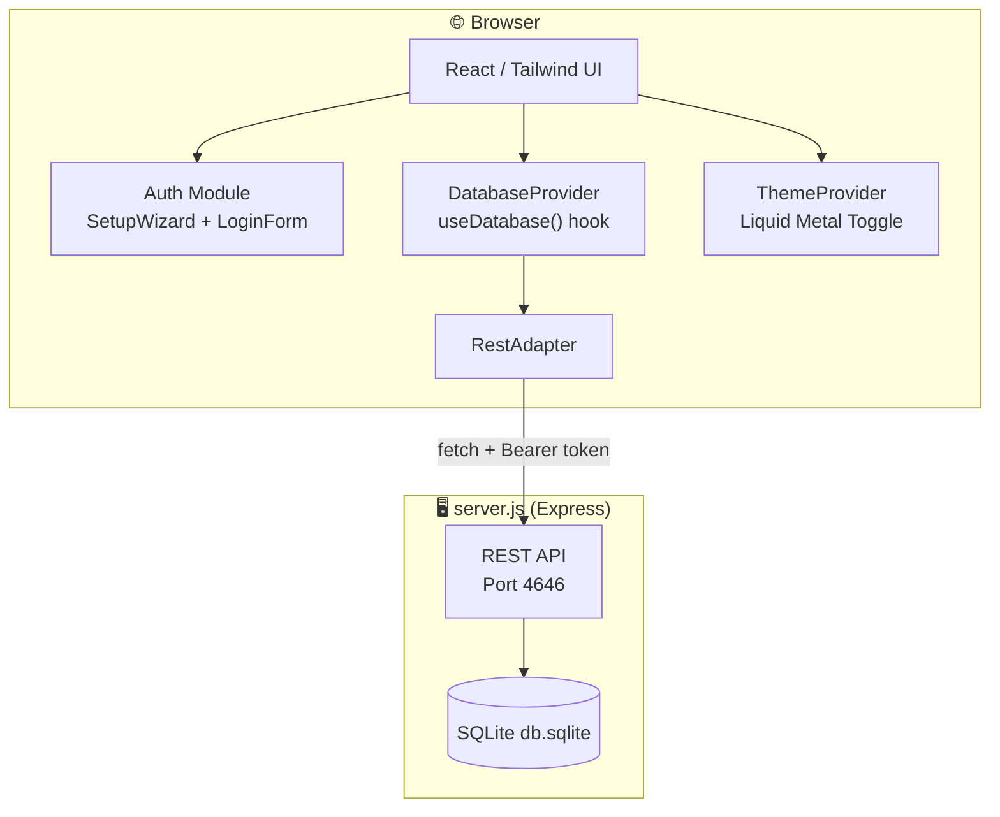

# 🦞 ClawChives

<div align="center">

```
  ██████╗██╗      █████╗ ██╗    ██╗ ██████╗██╗  ██╗██╗██╗   ██╗███████╗███████╗
 ██╔════╝██║     ██╔══██╗██║    ██║██╔════╝██║  ██║██║██║   ██║██╔════╝██╔════╝
 ██║     ██║     ███████║██║ █╗ ██║██║     ███████║██║██║   ██║█████╗  ███████╗
 ██║     ██║     ██╔══██║██║███╗██║██║     ██╔══██║██║╚██╗ ██╔╝██╔══╝  ╚════██║
 ╚██████╗███████╗██║  ██║╚███╔███╔╝╚██████╗██║  ██║██║ ╚████╔╝ ███████╗███████║
  ╚═════╝╚══════╝╚═╝  ╚═╝ ╚══╝╚══╝  ╚═════╝╚═╝  ╚═╝╚═╝  ╚═══╝  ╚══════╝╚══════╝
```

*Your Sovereign Pinchmark Library — where Humans and AI Lobsters collaborate to scuttle the web.*

</div>

---

[](https://vitejs.dev/)
[](https://reactjs.org/)
[](https://www.typescriptlang.org/)
[](https://tailwindcss.com/)
[](https://www.docker.com/)
[](https://www.sqlite.org/)
[](LICENSE)
[](#)

---

## 📜 Table of Contents

<details>
<summary>Unfurl the Scroll 📜</summary>

- [About](#-about)
- [Architecture](#-architecture)
- [Getting Started](#-getting-started)
  - [Prerequisites](#prerequisites)
  - [Running with npm](#-running-with-npm)
  - [Running with Docker](#-running-with-docker)
- [Key System](#-key-system)
- [API Reference](#-api-reference)
- [Project Structure](#-project-structure)
- [Available Scripts](#-available-scripts)
- [Contributing](#-contributing)
- [Security](#-security)

</details>

---

## 📌 About

**ClawChives** is a privacy-first, self-hostable **pinchmark** (bookmark) manager designed for the Human-Agent ecosystem. It stores your pinchmarks in an integrated SQLite backend, with a sovereign identity system that uses cryptographic key files instead of usernames and passwords.

No cloud. No landlords. Your reef, your rules.

- 🔐 **ShellCryption Auth** — login with a generated JSON identity file, or use **One-Field Login** with just your ClawKey©™.
- 🤖 **Lobster Key System** — issue granular `lb-` API keys to your AI agents and scripts. Let your Lobsters scuttle the net.
- 🗄️ **SQLite Bedrock** — a fast, reliable, zero-dependency backend for persistent local storage.
- 🐳 **Docker-First** — fully containerized with named volume mounts for seamless self-hosting.
- 🌊 **Liquid Metal Theming** — a stunning circular-reveal View Transition on every theme switch.
- 🦞 **r.jina.ai Reading Mode** — transform Pinchmarks to LLM-friendly markdown on-demand.
- 🐚 **Locked Shell UI** — A rigid, consistent interface layout that never shifts, ensuring a familiar "Reef" for both Humans and Agents.

---

## 🏗️ Architecture


---
## Screenshots
<details>
<summary>Expand To View Screenshots</summary>


</details>

---

## 🚀 Getting Started

### Prerequisites

- **Node.js** v20+
- **npm** v10+
- **Docker & Docker Compose** *(for containerized deployment)*

---

### 🐚 Running with npm

<details>
<summary>Expand npm instructions</summary>

**Install dependencies first:**
```bash
npm install
```

**Production Commands (The Great Scuttle):**
- **Start All**: `npm run scuttle:prod-start` (Builds frontend, then starts API + Frontend on `0.0.0.0`)
- **Stop All**: `npm run scuttle:prod-stop`
- **Reset DB**: `npm run scuttle:reset` (DANGER: Deletes prod reef)

**Development Commands (The Coral Nursery):**
- **Start All**: `npm run scuttle:dev-start` (API + Frontend w/ HMR on `localhost`)
- **Stop All**: `npm run scuttle:dev-stop`
- **Reset DB**: `npm run scuttle:reset-dev` (Scuttles dev reef)

---

**Utility Scripts:**
- **Start API Only**: `npm run start:api`
- **Frontend Dev Only**: `npm run dev`
- **Build Bundle**: `npm run build`
- **Preview Build**: `npm run preview`
- **Lint TypeScript**: `npm run lint`
- **Run Tests**: `npm test`

**Database Encryption (ShellCryption™ Layer 2):**

To enable AES-256 database encryption at rest, set the `DB_ENCRYPTION_KEY` environment variable before starting:

```bash
# Generate a secure encryption key
DB_ENCRYPTION_KEY=$(openssl rand -base64 32)
export DB_ENCRYPTION_KEY

# Then start the app (encryption will be enabled automatically)
npm run scuttle:dev-start
```

Or add it to your `.env` file:
```bash
DB_ENCRYPTION_KEY=your-generated-key-here
```

> [!TIP]
> Without `DB_ENCRYPTION_KEY` set, the database runs in plaintext mode (default). You can add encryption later — existing plaintext databases are automatically migrated when you enable the key.

</details>

---

### 🐳 Running with Docker

<details>
<summary>Expand Docker instructions</summary>

**Environment Variables:**

```bash
# ── Network & API ────────────────────────────────────────────────────────
UI_PORT=4545                                    # UI container port
API_PORT=4646                                   # API container port
CORS_ORIGIN=http://localhost:4545               # Set this to your UI origin (or leave unset for LAN)

# ── Database Encryption (SQLCipher / ShellCryption™ Layer 2) ──────────────
# AES-256 encryption at rest. Generate a key with: openssl rand -base64 32
# Leave unset for plaintext database (not recommended for production).
# WARNING: In docker-compose.yml, this env var is visible via 'docker inspect'.
#          For stronger protection, consider Docker Secrets or systemd services.
# DB_ENCRYPTION_KEY=your-generated-key-here

# ── Optional: Match database file permissions to your host user ──────────
PUID=1000
PGID=1000
```

**Option A: Production (Pull from GHCR) ⚓**
Use this for a stable, sovereign deployment. It pulls the latest pre-built images from the GitHub Container Registry.
```bash
docker compose up -d
```

**Option B: Development & Testing (Build Locally) 🛠️**
Use this if you are modifying the source code and want to test changes immediately.
```bash
docker compose -f docker-compose.dev.yml up -d --build
```

**Database Encryption (ShellCryption™ Layer 2):**

ClawChives supports **AES-256 encryption at rest** via SQLCipher. If the database file is stolen, it's an unreadable encrypted blob without the key.

To enable encryption, generate and set `DB_ENCRYPTION_KEY`:

```bash
# Generate a secure encryption key
DB_KEY=$(openssl rand -base64 32)
echo "Generated key: $DB_KEY"

# Option 1: Set in docker-compose.yml (comment line 22-23 and uncomment line 23):
# - DB_ENCRYPTION_KEY=$DB_KEY

# Option 2: Set in .env file (if using env_file in compose):
# DB_ENCRYPTION_KEY=$DB_KEY
```

Then start with: `docker compose up -d --build`

> [!IMPORTANT]
> **First-Time Encryption**: If you have an existing plaintext database and enable encryption, ClawChives will automatically migrate it. This is safe — your data is preserved.
>
> **Key Management**: Keep your `DB_ENCRYPTION_KEY` safe. If you lose it, your data becomes inaccessible. Store it separately from this repository.

**Monitoring & Maintenance:**

- **View Logs**: `docker compose logs -f`
- **Stop Stack**: `docker compose down`
- **Volume Inspection**: `docker volume inspect clawchives_sqlite_data`

> [!IMPORTANT]
> **Data Sovereignty & Persistence**:
> All pinchmarks and agent identities are stored in local bind mounts on your host system for maximum visibility and ease of backup.
> - **Production**: `./data/db.sqlite`
> - **Development**: `./data-dev/db.sqlite`
>
> You can directly copy or backup these directories. If they don't exist, Docker will create them as directories (root-owned) when the container starts. It is recommended to create them beforehand if you want specific permissions.

</details>

---

## 🔑 Key System

ClawChives uses a **prefix-based identity token system** — no passwords, no usernames stored on a server. Your key file is your identity.

| Prefix | Type | Length | Usage |
|---|---|---|---|
| `hu-` | **Human Key** | 64 chars | Your personal identity. Supports **One-Field Login** (key-only). |
| `lb-` | **Lobster/Agent Key** | 64 chars | For your AI Lobsters and automated scripts. Generated in Settings with granular CUSTOM permissions. |
| `api-` | **Session Token** | 32 chars | Short-lived REST API bearer. Issued via `POST /api/auth/token`. |

> [!CAUTION]
> Your `hu-` key file is the **only** way to access your ClawChive. Keep it safe. If you lose it, it cannot be recovered. Back it up somewhere dry.

---

## 🔌 API Reference

> All endpoints except `/api/health` and `/api/auth/token` require `Authorization: Bearer <api-token>`.

<details>
<summary>View full API endpoint table</summary>

| Method | Endpoint | Description |
|---|---|---|
| `GET` | `/api/health` | Health check + record counts |
| `POST` | `/api/auth/register` | Register a new identity |
| `POST` | `/api/auth/token` | Issue `api-` token from `hu-` or `lb-` key |
| `GET` | `/api/auth/validate` | Validate current Bearer token |
| `GET` | `/api/bookmarks` | List all pinchmarks (filterable) |
| `POST` | `/api/bookmarks` | Create pinchmark |
| `GET` | `/api/bookmarks/:id` | Get single pinchmark |
| `PUT` | `/api/bookmarks/:id` | Update pinchmark |
| `DELETE` | `/api/bookmarks/:id` | Delete pinchmark |
| `PATCH` | `/api/bookmarks/:id/star` | Toggle star |
| `PATCH` | `/api/bookmarks/:id/archive` | Toggle archive |
| `GET` | `/api/folders` | List all folders |
| `POST` | `/api/folders` | Create folder |
| `PUT` | `/api/folders/:id` | Update folder |
| `DELETE` | `/api/folders/:id` | Delete folder |
| `GET` | `/api/agent-keys` | List agent Lobster keys |
| `POST` | `/api/agent-keys` | Create agent Lobster key |
| `PATCH` | `/api/agent-keys/:id/revoke` | Revoke agent key |
| `DELETE` | `/api/agent-keys/:id` | Delete agent key |
| `GET` | `/api/settings/:key` | Get setting |
| `PUT` | `/api/settings/:key` | Update setting |

</details>

---

## 📂 Project Structure

See [BLUEPRINT.md](./BLUEPRINT.md) for the full ASCII construction diagram.

```
ClawChives/
├── src/
│   ├── components/             # Feature-scoped UI components
│   │   ├── auth/               # SetupWizard + LoginForm (Key-based auth)
│   │   ├── dashboard/          # Pinchmark grid, sidebar, modals, search
│   │   ├── landing/            # Unauthenticated landing page + gateway
│   │   ├── settings/           # AgentKey, Profile, Appearance panels
│   │   ├── theme-provider.tsx  # Liquid Metal View Transition theme context
│   │   └── ui/                 # Shadcn base components (Button, Input, etc.)
│   ├── services/
│   │   └── database/
│   │       ├── adapter.ts           # IDatabaseAdapter interface
│   │       ├── DatabaseProvider.tsx # React context + useDatabase() hook
│   │       └── rest/                # RestAdapter (SQLite REST mode)
│   ├── lib/
│   │   └── crypto.ts           # Key generation, hashing, file download
│   └── index.css               # Global styles + Liquid Metal transitions
├── server.js                   # Express + better-sqlite3 API server
├── Dockerfile                  # Frontend container
├── Dockerfile.api              # API server container
├── docker-compose.yml          # Full stack orchestration
├── .env.example                # Environment variable reference
├── .agents/
│   ├── GEMINI.md               # Agent intelligence directive
│   ├── AGENT_API_GUIDE.md      # REST API guide for Lobster agents
│   └── skills/
│       ├── lobster-auth-flow/  # Reusable key-based auth skill
│       └── liquid-metal-theme-toggle/ # Reusable theme toggle skill
└── README.md                   # You are here 🦞
```

---

## 🛠️ Available Scripts

| Script | Port(s) | Accessible | Description |
|---|---|---|---|
| `npm run scuttle:prod-start` | 4545 (UI), 4646 (API) | `0.0.0.0` (LAN) | 🦞 Builds frontend, starts API + UI production servers |
| `npm run scuttle:dev-start` | 4545 (UI), 4646 (API) | `localhost` only | Hatch development environment (API + UI w/ HMR) |
| `npm run scuttle:prod-stop` | — | — | Kill the API and UI server processes |
| `npm run scuttle:reset` | — | — | Scuttle the production database (DANGER) |
| `npm run scuttle:reset-dev` | — | — | Scuttle the development database |
| `npm run start:api` | 4646 | `0.0.0.0` | Start only the Express API server |
| `npm run dev` | 4545 | `localhost` only | Vite dev server with HMR |
| `npm run build` | — | — | Build production bundle (`npm run build` required before `scuttle:prod-start`) |
| `npm run preview` | 4545 | `localhost` only | Serve the production `dist/` locally for testing |
| `npm run lint` | — | — | ESLint check across all `.ts` / `.tsx` files |

---

## 🤝 Contributing

See [CONTRIBUTING.md](./CONTRIBUTING.md) for the full guide.

## 🛡️ Security

See [SECURITY.md](./SECURITY.md) for vulnerability reporting and key security practices.

---

<div align="center">

```
       _..._
     .'     '.      HATCH YOUR CLAWCHIVE.
    /  _   _  \     RECLAIM YOUR LINKS.
    | (q) (p) |     PUNCH THE CLOUD.
    (_   Y   _)
     '.__W__.'
     _.'   '._
    (         )
     '._ _ .-'
        'u'
```

*Maintained with 🦞 by Lucas*

</div>
