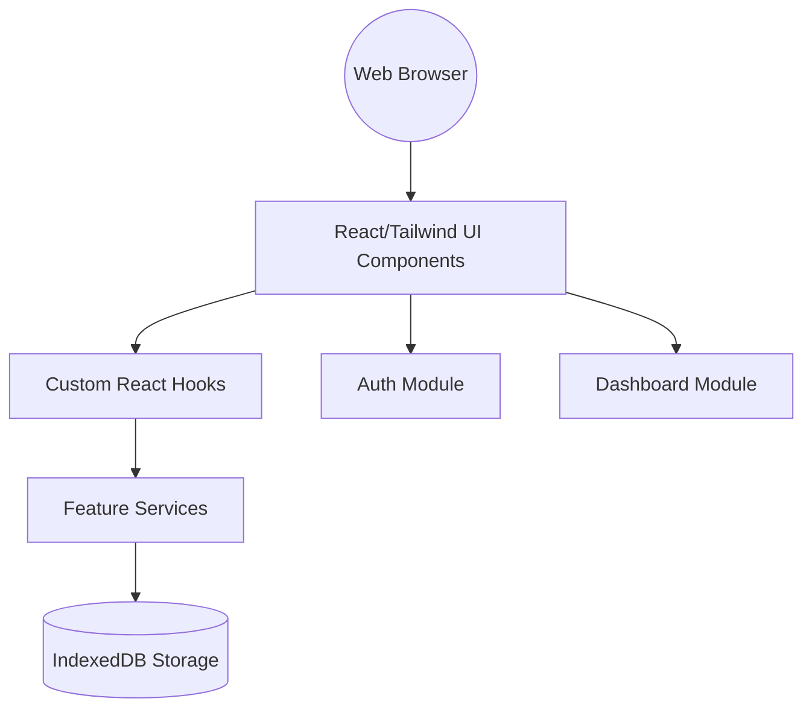

# 🌿 ClawChives

> A modular frontend application designed for the Lobster Ecosystem.

```text
    __/\__
. _ \\''// _ .
 -( )-==-( )-
   '      '
 ClawChives UI
```

[](https://vitejs.dev/)
[](https://reactjs.org/)
[](https://www.typescriptlang.org/)
[](https://tailwindcss.com/)
[](https://www.docker.com/)

## 📜 Table of Contents
<details>
  <summary>Click to expand</summary>

  - [About](#-about)
  - [Architecture](#-architecture)
  - [Getting Started](#-getting-started)
    - [Prerequisites](#prerequisites)
    - [Docker Setup (Recommended)](#docker-setup-recommended)
    - [Local Development Setup](#local-development-setup)
  - [Available Scripts](#-available-scripts)
  - [Project Structure](#-project-structure)
  - [Contributing](#-contributing)
  - [Security](#-security)
</details>

## 📌 About

ClawChives is a Vite-powered React application using TypeScript and Tailwind CSS. It is structured to ensure a clean separation of concerns by feature, making it highly maintainable and easily navigable. This application incorporates IndexedDB for client-side storage and is fully containerized for a seamless development experience.

## 🏗️ Architecture



## 🚀 Getting Started

### Prerequisites
- Node.js (v20+)
- npm (v10+)
- Docker & Docker Compose (for containerized development)

### Docker Setup (Recommended)

Run the application seamlessly using Docker with volume bind mounts to ensure your local changes reflect instantly.

```bash
# 1. Build and start the container in detached mode
docker-compose up -d --build

# 2. View the application logs
docker-compose logs -f claw-chives

# 3. Access the application in your browser
# URL: http://localhost:5173
```

To stop the container:
```bash
docker-compose down
```

### Local Development Setup

If you prefer running the application natively:

```bash
# 1. Install project dependencies
npm install

# 2. Start the Vite development server
npm run dev

# 3. Access the application in your browser
# URL: http://localhost:5173
```

## 🛠️ Available Scripts

- `npm run dev` - Starts the Vite development server with Hot Module Replacement (HMR).
- `npm run build` - Type-checks the TypeScript code and produces a production-ready bundle.
- `npm run preview` - Boots up a local web server that serves the files from the `dist` directory for testing the production build.
- `npm run lint` - Runs ESLint to find and fix styling or compilation errors.

## 📂 Project Structure

Organized strictly by feature concerns. Refer to [BLUEPRINT.md](./BLUEPRINT.md) for an in-depth component-level view.

## 🤝 Contributing

We welcome contributions! Please review our [CONTRIBUTING.md](./CONTRIBUTING.md) guide before submitting any pull requests.

## 🛡️ Security

For vulnerability reporting and security practices, please read the [SECURITY.md](./SECURITY.md) guidelines.

---
*Maintained by Lucas.*
