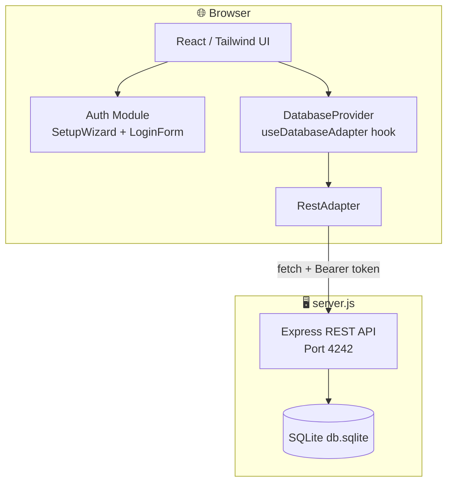

# 🦞 ClawChives

<div align="center">

```
  ██████╗██╗      █████╗ ██╗    ██╗ ██████╗██╗  ██╗██╗██╗   ██╗███████╗███████╗
 ██╔════╝██║     ██╔══██╗██║    ██║██╔════╝██║  ██║██║██║   ██║██╔════╝██╔════╝
 ██║     ██║     ███████║██║ █╗ ██║██║     ███████║██║██║   ██║█████╗  ███████╗
 ██║     ██║     ██╔══██║██║███╗██║██║     ██╔══██║██║╚██╗ ██╔╝██╔══╝  ╚════██║
 ╚██████╗███████╗██║  ██║╚███╔███╔╝╚██████╗██║  ██║██║ ╚████╔╝ ███████╗███████║
  ╚═════╝╚══════╝╚═╝  ╚═╝ ╚══╝╚══╝  ╚═════╝╚═╝  ╚═╝╚═╝  ╚═══╝  ╚══════╝╚══════╝
```

*A self-hosted, server-backed bookmark manager for the Human-Agent Ecosystem*

</div>

---

[](https://vitejs.dev/)
[](https://reactjs.org/)
[](https://www.typescriptlang.org/)
[](https://tailwindcss.com/)
[](https://www.docker.com/)
[](https://www.sqlite.org/)
[](LICENSE)
[](#)

---

## 📜 Table of Contents

<details>
<summary>Click to expand</summary>

- [About](#-about)
- [Architecture](#-architecture)
- [Getting Started](#-getting-started)
  - [Prerequisites](#prerequisites)
  - [Docker / Self-Hosted](#docker--self-hosted)
- [API Reference](#-api-reference)
- [Key System](#-key-system)
- [Available Scripts](#-available-scripts)
- [Project Structure](#-project-structure)
- [Contributing](#-contributing)
- [Security](#-security)

</details>

---

## 📌 About

**ClawChives** is a privacy-first, self-hostable bookmark manager built with Vite + React + TypeScript. It stores your bookmarks securely in an integrated SQLite backend, offering persistent server-side storage and cross-device availability.

- 🔐 **Identity Key Authentication** — login with a generated JSON identity file, not a password
- 🤖 **Agent Key System** — generate API access keys (`ag-`) for automated agents and scripts
- 🗄️ **SQLite Server** — backend architecture for reliable and powerful state management
- 🐳 **Docker-First** — fully containerized with persistent volume mounts

---

## 🏗️ Architecture



---

## 🚀 Getting Started

### Prerequisites

- **Node.js** v20+
- **npm** v10+
- **Docker & Docker Compose** *(for containerized modes)*

---

### Docker / Self-Hosted

Persistent server-side storage. Requires `server.js` alongside the frontend.

**Local development (2 terminals):**
```bash
# Terminal 1 — API server
npm install
node server.js
# → http://localhost:4242/api/health

# Terminal 2 — Frontend
npm run dev
# → http://localhost:5173
```

**Docker (recommended):**
```bash
docker-compose up -d --build

# View logs
docker-compose logs -f claw-chives-api

# Stop
docker-compose down
```

Data is persisted in the `sqlite_data` Docker volume at `/app/data/db.sqlite`.

---

## 🔌 API Reference

> All endpoints except `/api/health` and `/api/auth/token` require `Authorization: Bearer <api-token>`.

<details>
<summary>View full API endpoint table</summary>

| Method | Endpoint | Description |
|---|---|---|
| `GET` | `/api/health` | Health check + record counts |
| `POST` | `/api/auth/token` | Issue `api-` token from `hu-` or `ag-` key |
| `GET` | `/api/auth/validate` | Validate current Bearer token |
| `GET` | `/api/bookmarks` | List all bookmarks (filterable) |
| `POST` | `/api/bookmarks` | Create bookmark |
| `GET` | `/api/bookmarks/:id` | Get single bookmark |
| `PUT` | `/api/bookmarks/:id` | Update bookmark |
| `DELETE` | `/api/bookmarks/:id` | Delete bookmark |
| `PATCH` | `/api/bookmarks/:id/star` | Toggle star |
| `PATCH` | `/api/bookmarks/:id/archive` | Toggle archive |
| `GET` | `/api/folders` | List all folders |
| `POST` | `/api/folders` | Create folder |
| `PUT` | `/api/folders/:id` | Update folder |
| `DELETE` | `/api/folders/:id` | Delete folder |
| `GET` | `/api/agent-keys` | List agent keys |
| `POST` | `/api/agent-keys` | Create agent key |
| `PATCH` | `/api/agent-keys/:id/revoke` | Revoke agent key |
| `DELETE` | `/api/agent-keys/:id` | Delete agent key |
| `GET` | `/api/settings/:key` | Get setting |
| `PUT` | `/api/settings/:key` | Update setting |

</details>

---

## 🔑 Key System

ClawChives uses a prefix-based cryptographic key system:

| Prefix | Type | Usage |
|---|---|---|
| `hu-` | **Human Key** | Your personal identity key (in `clawchives_identity_key.json`) |
| `ag-` | **Agent Key** | For automated scripts/agents (generated in Settings) |
| `api-` | **REST Token** | Short-lived token for API access (issued via `POST /api/auth/token`) |

All keys are 64-character random strings. Your `hu-` key is paired with a UUID and exported as a JSON identity file — **keep it safe, it cannot be recovered**.

---

## 🛠️ Available Scripts

| Script | Description |
|---|---|
| `npm run dev` | Vite dev server with HMR on `http://localhost:5173` |
| `npm run build` | TypeScript check + Vite production bundle → `dist/` |
| `npm run preview` | Serve the production `dist/` locally |
| `npm run lint` | ESLint check across all `.ts` / `.tsx` files |
| `node server.js` | Start the Express/SQLite API server on port `4242` |

---

## 📂 Project Structure

See [BLUEPRINT.md](./BLUEPRINT.md) for the full ASCII construction diagram.

```
ClawChives/
├── src/
│   ├── components/          # Feature-scoped UI components
│   │   ├── auth/            # SetupWizard + LoginForm
│   │   ├── dashboard/       # Bookmark grid, sidebar, modals
│   │   ├── landing/         # Unauthenticated landing page
│   │   └── settings/        # AgentKey, Profile, Appearance
│   ├── services/
│   │   └── database/
│   │       ├── adapter.ts           # IDatabaseAdapter interface
│   │       ├── DatabaseProvider.tsx # React context + hook
│   │       └── rest/                # RestAdapter (SQLite mode)
├── server.js                # Express + SQLite API server
├── Dockerfile               # Frontend container
├── Dockerfile.api           # API server container
├── docker-compose.yml       # Stack Orchestration
└── .env.example             # Environment variable reference
```

---

## 🤝 Contributing

See [CONTRIBUTING.md](./CONTRIBUTING.md) for the full guide.

## 🛡️ Security

See [SECURITY.md](./SECURITY.md) for vulnerability reporting and key security practices.

---

<div align="center">

*Maintained with 🦞 by Lucas*

</div>
