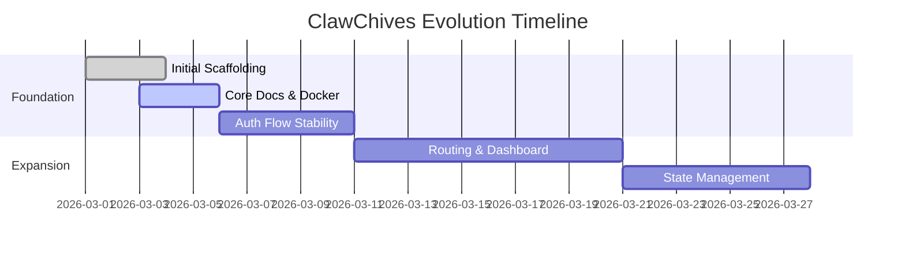

# 🗺️ ClawChives Roadmap

This document outlines the planned trajectory for the ClawChives project. The application will evolve systematically, balancing new features with continuous refinement.

## Phase 1: Foundation (Current)
- [x] Initial React scaffolding with Vite.
- [x] Setup TailwindCSS for rapid prototyping.
- [x] Dockerization with volume bind mounts for optimal dev workflow.
- [x] Complete documentation suite (README, ROADMAP, BLUEPRINT, etc.).
- [ ] Stabilize initial Auth/Setup flows using IndexedDB.

## Phase 2: Feature Expansion
- [ ] Implement enhanced routing architecture.
- [ ] Integrate advanced Dashboard analytic visualizations.
- [ ] Setup global application state management.
- [ ] Add dark mode toggle configuration.

## Phase 3: Performance & Hardening
- [ ] Implement comprehensive React component unit tests.
- [ ] Setup automated e2e testing.
- [ ] Transition local DB storage logic to secure background workers.
- [ ] Fine-tune Vite bundle chunking for optimal load times.

## Future Explorations
- [ ] Multi-tenant capability research.
- [ ] Integration with Lobster News Network API endpoints.
- [ ] Real-time updates via WebSockets.

