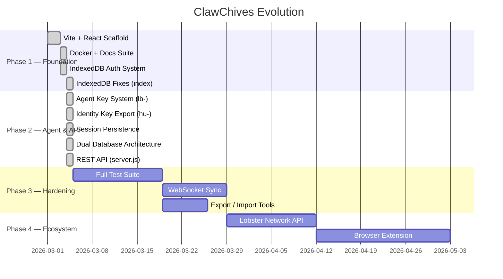

# 🗺️ ClawChives — Roadmap

This document tracks where ClawChives has been, where it is now, and where it's going.

---

## Timeline Overview

---

## ✅ Phase 1 — Foundation

View completed items

- [x] Vite + React + TypeScript scaffold
- [x] TailwindCSS + shadcn/ui component system
- [x] Docker containerization with volume bind mounts
- [x] Full documentation suite (README, ROADMAP, BLUEPRINT, CONTRIBUTING, SECURITY)
- [x] IndexedDB core storage layer
- [x] Setup Wizard (first-run onboarding)
- [x] Landing page

---

## 🔄 Phase 2 — Agent & API Layer *(Active)*

View completed & in-progress items

- [x] **Identity Key System** — `hu-` human keys with UUID + JSON export (`clawchives_identity_key.json`)
- [x] **Agent Key System** — `lb-` agent keys with expiration, rate limits, and **granular CUSTOM permissions**
- [x] **SQLite-Only Architecture** — Dropped IndexedDB entirely for a centralized robust SQLite backend
- [x] **REST API Server** (`server.js`) — Express + SQLite mapped securely to user UUIDs
- [x] **Strict API Middleware** — `requirePermission` rigidly enforces `canRead/Write/Delete/Move/Edit`
- [x] **File Download Fallbacks** — Download Identity keys and individual Lobster keys cross-origin
- [x] **Lobsterized UI Modals** — Brand-colored Confirm/Alert/Block modals replacing browser dialogs
- [x] **Docker Dual-Profile** — `dev` and `api` compose profiles mapped to local volumes
- [ ] Export/Import UI for bookmarks (JSON & CSV)
- [x] Liquid Metal Dark mode toggle via View Transitions
- [x] **r.jina.ai Reading Mode** — LLM-friendly markdown conversion with dual-click context menu
- [x] **One-Field Login** — Simplified authentication via `hu-` key alone
- [x] **Database Migration Safety** — Automated uniqueness enforcement for `key_hash`
- [x] **V2 Backend Refactor** — Migrated to TypeScript feature-split architecture (`src/server/`) matching PinchPad

---

## 🔜 Phase 3 — Hardening & Polish

- [ ] Comprehensive component unit tests (Vitest + React Testing Library)
- [ ] End-to-end test suite (Playwright)
- [ ] WebSocket-based real-time bookmark sync SQLite
- [ ] Vite bundle chunking optimisation
- [ ] Progressive Web App (PWA) manifest + offline support
- [ ] Bookmark favicon auto-fetch

---

## 🔭 Phase 4 — Lobster Ecosystem Integration

- [ ] Lobster News Network API integration
- [ ] Browser extension (Chrome/Firefox) for one-click bookmarking
- [ ] Multi-device sync via user-controlled relay server
- [ ] Webhook support for `lb-` keys
- [ ] Public read-only share links for bookmark collections
- [ ] r.jina.ai integration for bookmark summarization in markdown for lobster parsing

---

## 💡 Future Explorations

- [ ] Multi-user/team bookmark collections
- [ ] AI-powered tag suggestions
- [ ] Read-later with offline article caching
