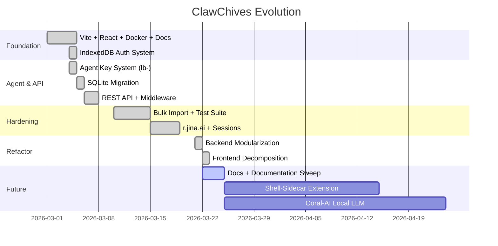

# 🗺️ ClawChives — Roadmap

> This document tracks where ClawChives has been, where it is now, and where it's going.

---

## 🗓️ Timeline Overview

---

## ✅ Completed Phases

Phase 6 — Full Frontend Decomposition (2026-03-22)

> All frontend components are now under the 250-line CrustCode©™ limit.

**Sub-Phase 6a — Dashboard Domain:**
- [x] `DatabaseStatsModal.tsx` → `StatsCards.tsx` + `BookmarkTable.tsx`
- [x] `Sidebar.tsx` → `SidebarNav.tsx` + `FolderList.tsx`

**Sub-Phase 6b — Settings Domain:**
- [x] `AgentPermissions.tsx` → `AgentKeyCard.tsx` + `agentPermissionsUtils.ts`
- [x] `ImportExportSettings.tsx` → `ImportSection.tsx` + `ExportSection.tsx`
- [x] `LobsterImportModal.tsx` → `useLobsterSession.ts` + `ImportSteps.tsx`

**Sub-Phase 6c — Shared Domain:**
- [x] `LobsterModal.tsx` → `modals/` directory (ConfirmModal, AlertModal, TagBlockedModal)
- [x] Dead `api.ts` + `api.test.ts` removed
- [x] `exportImport.ts` → modular export system with pluggable formatters (JSON, HTML, CSV)
- [x] Encryption logic centralized into `crypto.ts`

Phase 5 — Backend Modularization (2026-03-22)

- [x] `db.ts` decomposed into `src/server/database/` (connection, schema, migrations)
- [x] `bookmarks.ts` route decomposed into atomic handlers (`read`, `write`, `bulk`, `toggles`)
- [x] Frontend reorganized into `src/features/` + `src/shared/` (true domain slice)
- [x] Absolute path aliases — no relative import ambiguity

Phase 4 — Ephemeral Sessions + Badge Counts (2026-03-19)

- [x] Lobster Import Session system (`lb-eph-*` keys, 15min TTL)
- [x] Real-time `GET /api/bookmarks/stats` badge counts (independent of pagination)
- [x] `useBookmarkStats()` React Query hook
- [x] 19 Lobster session tests

Phase 3 — Hardening & Polish (2026-03-19)

- [x] 131-test suite (Unit + Middleware + Integration + Build Gates)
- [x] Mass import tests (1000 URL batches)
- [x] Performance indexing (async folder counts, zero-sort indexes)
- [x] Build validation gates (TypeScript lint, npm build, Docker build)

Phase 2 — Agent & API Layer (2026-03-10)

- [x] Identity Key System (`hu-`) + JSON export
- [x] Agent Key System (`lb-`) with granular CUSTOM permissions
- [x] SQLite-Only Architecture (IndexedDB dropped)
- [x] REST API (`server.ts`) + strict middleware (`requirePermission`)
- [x] Lobsterized UI Modals (Confirm/Alert/TagBlocked)
- [x] Liquid Metal Dark Mode toggle (View Transitions)
- [x] r.jina.ai Reading Mode (LLM-friendly markdown, human-only)
- [x] One-Field Login via `hu-` key hash lookup

Phase 1 — Foundation (2026-03-01)

- [x] Vite + React + TypeScript scaffold
- [x] TailwindCSS + shadcn/ui components
- [x] Docker containerization with volume bind mounts
- [x] Full documentation suite (README, ROADMAP, BLUEPRINT, CONTRIBUTING, SECURITY)
- [x] Setup Wizard + Landing page

---

## 🔜 Phase 7 — Documentation Sweep *(Active)*

- [/] CRUSTAGENT.md rewrite (collapsible + Phase 6 updates)
- [/] src/CRUSTAGENT.md rewrite (current file map + Phase 6)
- [ ] ROADMAP.md update *(this file)*
- [ ] CRUSTSECURITY.md update
- [ ] README.md update
- [ ] BLUEPRINT.md update (new directory structure)
- [ ] `.crustagent/knowledge/` update (post-Phase 6 patterns)

---

## 🔭 Phase 8 — Lobster Ecosystem Integration

rename the agent_keys table and routes to lobster_keys to be more aligned to Lobsterized philosophy.
- [ ] **Shell-Sidecar** — Browser extension for one-click pinching (Chrome/Firefox)
- [ ] **Molt-Sync** — Encrypted p2p sync between browser and remote SQLite
- [ ] Webhook support for `lb-` keys
- [ ] Public read-only share links for bookmark collections

---

## 🧠 Phase 9 — Coral-AI

- [ ] **Coral-AI** — Integrated local LLM for automatic Pinchmark summarization (r.jina.ai streams)
- [ ] AI-powered tag suggestions
- [ ] Read-later with offline article caching

---

## 💡 Future Reef

- [ ] Multi-user/team bookmark collections
- [ ] Progressive Web App (PWA) manifest + offline support
- [ ] Bookmark favicon auto-fetch
- [ ] WebSocket-based real-time sync

---

**Maintained by CrustAgent©™**

